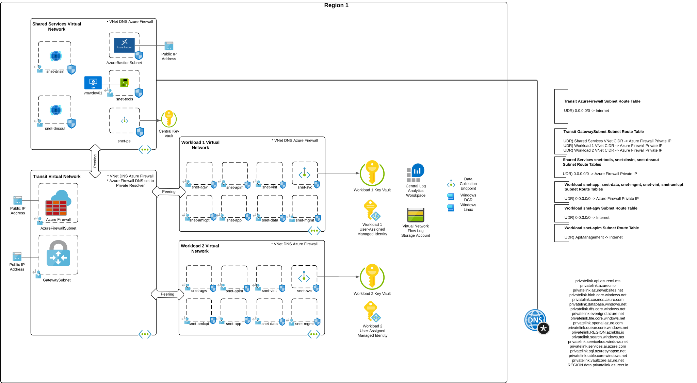

# Azure Hub and Spoke Lab with Azure Firewall

[](https://www.terraform.io/)
[](https://azure.microsoft.com/)
[](LICENSE)

## Table of Contents
- [Overview](#overview)
- [Architecture](#architecture)
- [Features](#features)
- [Prerequisites](#prerequisites)
- [Quick Start](#quick-start)
- [Configuration](#configuration)
- [Deployment](#deployment)
- [Post-Deployment](#post-deployment)
- [Security Considerations](#security-considerations)
- [Troubleshooting](#troubleshooting)
- [Updates](#updates)
- [Contributing](#contributing)

## Overview
This Terraform configuration provisions an enterprise-grade Azure Hub and Spoke network architecture with centralized security controls. The lab environment is designed for learning, testing, and demonstrating enterprise networking patterns with Azure Firewall as the central security appliance.

### Key Benefits
- **Centralized Security**: All traffic flows through Azure Firewall for inspection and policy enforcement
- **Scalable Architecture**: Hub and spoke model supports easy addition of new workload spokes
- **Enterprise-Ready**: Includes logging, monitoring, and security features found in production environments
- **Multi-Region Support**: Optional deployment across two Azure regions for high availability testing

## Architecture

The solution implements a **Hub and Spoke network topology** with the following design principles:

### Network Segmentation
- **Transit Resource Group**: Contains the hub virtual network with Azure Firewall
- **Shared Services Resource Group**: Houses DNS services, bastion, and shared infrastructure
- **Workload Resource Group**: Dedicated space for application workloads

### Traffic Flow
All network traffic (north-south, east-west) is routed through Azure Firewall in the hub, enabling:
- Centralized security policy enforcement
- Comprehensive traffic logging and monitoring
- Threat protection and filtering

### Single Region Deployment


### Multi-Region Deployment
When `multi_region = true`, the solution deploys across two regions with:
- Region-specific hub and spoke networks
- Shared global Private DNS zones for cross-region resolution
- Consistent security policies across regions


## Features

### 🔒 Security & Compliance
- **Azure Firewall Premium**: Advanced threat protection with IDPS capabilities
- **DNS Security Policies**: Domain filtering and threat intelligence
- **Network Security Groups**: Granular subnet-level access controls
- **Private Endpoints**: Secure connectivity to Azure PaaS services
- **Key Vault Integration**: Centralized secrets management

### 🌐 Network & Connectivity
- **Azure Private DNS Resolver**: Centralized DNS resolution
- **VPN Gateway**: Hybrid connectivity support
- **Multiple Workload Spokes**: Flexible workload isolation
- **Application Gateway Ready**: Pre-configured subnets and NSG rules
- **API Management Ready**: Internal deployment support

### 📊 Monitoring & Logging
- **VNet Flow Logs**: Network traffic analysis and monitoring
- **Azure Monitor Integration**: Centralized logging and alerting
- **Traffic Analytics**: Visual insights into network patterns
- **Diagnostic Settings**: Comprehensive audit trail

### 💻 Management & Access
- **Azure Bastion**: Secure remote access without public IPs
- **Windows Tools VM**: Pre-configured with Azure CLI, PowerShell, VS Code
- **Data Collection Rules**: Automated VM monitoring setup

### 🔧 DevOps & Automation
- **Terraform 1.8.3+**: Infrastructure as Code
- **Modular Design**: Reusable components
- **Tagging Strategy**: Automated resource tagging with creation metadata

## Prerequisites

### Azure Requirements
1. **Azure Subscription**: Active subscription with sufficient permissions
2. **Azure Permissions**: `Owner` role or equivalent delegated permissions for:
   - Resource group creation and management
   - Role assignment creation
   - Network resource provisioning

3. **Network Watcher**: Must be enabled in target regions using Azure Portal method
   - ⚠️ **Important**: Use Azure Portal, not CLI, to ensure proper naming (`NetworkWatcher_<region>`)
   - CLI creates resources with incorrect naming pattern that will cause deployment failures

### Local Development Environment
1. **Terraform**: Version 1.8.3 or higher
   ```bash
   terraform version
   ```

2. **Azure CLI**: Latest version recommended
   ```bash
   az version
   ```

3. **Git**: For cloning the repository
   ```bash
   git --version
   ```

### Required Information
Before deployment, gather the following:

1. **Key Vault Administrator Object ID**:
   ```bash
   az ad user show --id your-email@domain.com --query id --output tsv
   ```

2. **Trusted IP Address**: Your public IP for Key Vault firewall rules
   ```bash
   curl ifconfig.me
   ```

3. **Target Azure regions**: Primary and secondary (if using multi-region)

## Quick Start

### 1. Clone Repository
```bash
git clone <repository-url>
cd azure-terraform-code/base-labs/hub-and-spoke-azfw
```

### 2. Configure Variables
Copy the example configuration:
```bash
cp terraform.tfvars-example terraform.tfvars
```

Edit `terraform.tfvars` with your values:
```hcl
# Required Variables
key_vault_admin                    = "your-user-object-id"
trusted_ip                        = "your.public.ip.address"
location_primary                   = "canadacentral"
admin_username                     = "azureuser"
admin_password                     = "SecurePassword123!"

# Network Configuration
address_space_cloud                = "10.0.0.0/8"
address_space_azure_primary_region = "10.0.0.0/20"
address_space_onpremises           = "192.168.0.0/16"

# Multi-region (optional)
multi_region                       = false
location_secondary                 = "canadaeast"
address_space_azure_secondary_region = "10.0.16.0/20"

# Tagging
tags = {
  environment = "lab"
  project     = "networking"
  owner       = "your-team"
}
```

### 3. Deploy Infrastructure
```bash
# Initialize Terraform
terraform init

# Plan deployment
terraform plan

# Deploy with limited parallelism to avoid API limits
terraform apply -parallelism=3
```

## Configuration

### Network Design
The solution uses a supernet approach with these defaults:

| Component | Default CIDR | Purpose |
|-----------|--------------|---------|
| Cloud Supernet | `10.0.0.0/8` | Overall address space |
| Primary Region | `10.0.0.0/20` | Hub and spokes in primary region |
| Secondary Region | `10.0.16.0/20` | Hub and spokes in secondary region |
| On-premises | `192.168.0.0/16` | VPN site networks |

### Subnet Allocation
Each region automatically allocates subnets for:
- Azure Firewall subnet
- Gateway subnet
- Bastion subnet
- Application Gateway subnet
- API Management subnet
- Azure Machine Learning compute subnet
- Private endpoint subnet
- General workload subnets

### Private DNS Zones
The following zones are automatically created and linked:
- `privatelink.azurecr.io` - Container Registry
- `privatelink.database.windows.net` - SQL Database
- `privatelink.blob.core.windows.net` - Storage Account (Blob)
- `privatelink.vaultcore.azure.net` - Key Vault
- `privatelink.openai.azure.com` - Azure OpenAI
- `privatelink.api.azureml.ms` - Azure Machine Learning
- And many more...

## Deployment

### Standard Deployment
For basic single-region deployment:
```bash
terraform apply -parallelism=3
```

### Multi-Region Deployment
For high-availability across regions:
```bash
# Set multi_region = true in terraform.tfvars
terraform apply -parallelism=3
```

### Custom Parallelism
Azure ARM API has rate limits. Adjust parallelism based on your needs:
```bash
# Conservative (recommended for large deployments)
terraform apply -parallelism=1

# Standard (good balance)
terraform apply -parallelism=3

# Aggressive (only for small deployments)
terraform apply -parallelism=5
```

## Post-Deployment

### Verification Steps
1. **Check Resource Groups**: Verify all resource groups are created
2. **Test Connectivity**: Connect to Windows VM via Bastion
3. **Validate Firewall**: Check Azure Firewall logs in Log Analytics
4. **DNS Resolution**: Test private DNS resolution

### Initial Configuration
1. **Windows Tools VM**: Access via Bastion for management tasks
2. **Key Vault**: Retrieve admin credentials from the central Key Vault
3. **Monitoring**: Configure additional alerts in Azure Monitor

### Connecting Workloads
To add additional workloads:
1. Deploy resources in the workload resource group
2. Connect to the workload spoke subnets
3. Configure private endpoints for Azure services
4. Update firewall rules as needed

## Security Considerations

### Network Security
- All subnets have dedicated Network Security Groups
- Default deny-all rules with explicit allow rules
- Private endpoints for all Azure PaaS services
- No direct internet access from workload subnets

### Access Control
- Azure AD integration for Key Vault access
- Bastion for secure VM access (no RDP/SSH over internet)
- Managed identities for service-to-service authentication

### Monitoring
- All network flows are logged and analyzed
- Security events are forwarded to Log Analytics
- Traffic analytics provide visibility into communication patterns

### DNS Security
- DNS security policies block malicious domains
- Private DNS resolution prevents data exfiltration
- DNS query logging for audit and forensics

## Troubleshooting

### Common Issues

#### Deployment Failures
```bash
# Check Terraform state
terraform show

# View detailed error logs
terraform apply -parallelism=1 -auto-approve
```

#### Network Connectivity Issues
1. Check NSG rules: Ensure proper allow rules exist
2. Verify route tables: Confirm traffic routes through firewall
3. Check firewall rules: Validate application and network rules

#### DNS Resolution Problems
1. Verify private DNS zones are linked to VNets
2. Check DNS security policies
3. Validate private DNS resolver configuration

## Updates

### 2025
* **July 28, 2025**
  * Updated DNS security policies with new blocked domain configurations
  * Enhanced documentation with industry best practices
  * Improved README structure and content organization

* **March 17, 2025** *(Note: Date corrected from original typo)*
  * Added additional workload spoke for enhanced workload separation
  * Added dedicated subnet to support Azure Machine Learning injected compute scenarios
  * Expanded Private DNS Zones collection for additional Azure services
  * Enhanced support for AI/ML workloads with proper network isolation

### 2024
* **November 12, 2024**
  * Modified SSH ports from 22 to 2222 for enhanced security posture
  * Updated Network Security Group rules to reflect new SSH port configuration

* **October 28, 2024**
  * Extensive cleanup and optimization of IP address ranges for better resource utilization
  * Added comprehensive support for multi-region deployments
  * Improved network segmentation and routing logic

* **July 22, 2024**
  * Added dedicated subnets, route tables, and NSGs for Application Gateway deployment
  * Added dedicated subnets, route tables, and NSGs for API Management internal mode
  * Enhanced Azure Firewall rules to support internal API Management traffic flows
  * Improved support for application-tier networking components

* **June 7, 2024**
  * Initial release with core hub and spoke architecture
  * Basic Azure Firewall integration and network segmentation
  * Foundation security and monitoring components
