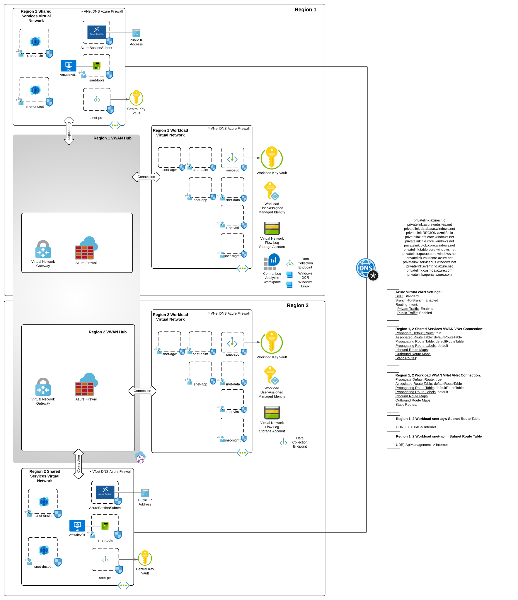

# Azure VWAN Secure Hub

## Updates
* 11/19/2024
  * Initial release

## Overview
The Terraform code in this repository provisions a lab environment for learning and experimentation with Azure Virtual WAN in a [Secure Hub design](https://learn.microsoft.com/en-us/azure/firewall-manager/secured-virtual-hub).

## Architecture
The environment is deployed across three resource groups. One resource group is dedicated to network components (transit), another to shared infrastructure (shared services), and the last dedicated to workload components (workload).

It uses a [Azure Virtual WAN](https://learn.microsoft.com/en-us/azure/virtual-wan/) deployed in a [Secure Hub design](https://learn.microsoft.com/en-us/azure/firewall-manager/secured-virtual-hub) with Azure Firewall to provide routing, centralized traffic mediation and inspection for traffic between Azure and on-premises, between virtual networks in a region, and between virtual networks spread across multiple regions.

*Single Region*

It can optionally be deployed to multiple regions by setting the Terraform parameter multi_region to true. It will then create three additional resource groups in the second region with the same structure as the primary region. This multi-region setup can be used to experiment with Azure VWAN Secure Hub across regions.

*Multi-Region*

Other features include:

1) DNS Query logging through Azure Firewall
2) Azure VPN Gateway to support hybrid connectivity
3) VNet Flow Logs and traffic analytics to provide for insight into network traffic flows
4) Azure Bastion to provide for secure remote access
5) Windows virtual machine provisioned with a variety of tools including Azure Powershell, Azure CLI, and Visual Studio Code
6) Diagnostic logging enabled for all services that support it with logs being sent to a central Log Analytics Workspace
7) Private DNS Zones for commonly used services linked to the shared services virtual network to support centralized DNS resolution
8) Managed identity and Azure Key Vault provisioned for use with application workloads
9) Centralized Azure Key Vault which stores username and password configured on the virtual machine
10) Azure Monitor Data Collection Rules for Linux and Windows Virtual Machines

## Prerequisites
1. You must hold at least the Owner role within each Azure subscription you configure the template to deploy resources to or you must have sufficient delegated permissions to create role assignments.

2. Get the object id of the security principal (user, managed identity, service principal) that will have access to the Azure Key Vault instance. This will be used for the key_vault_admin parameter when running the code. Ensure you are using the most up to date version of az cli.

**az ad user show --id someuser@sometenant.com --query id --output tsv**

3. The virtual machines provisioned by this code draw their bootstrapping scripts from this repository stored in the /scripts folder.

4. Enable Network Watcher in the region you plan to deploy the resources using the Azure Portal method described in this link. Do not use the CLI option because the templates expect the Network Watcher resource to be named NetworkWatcher_REGION, such as NetworkWatcher_eastus2. The CLI names the resource watcher_REGION such as watcher_eastus2 which will cause the deployment of the environment to fail.

5. You must have at least Terraform version 1.8.3 installed on your machine.

## Installation
1. Clone the repository.

2. Create a [terraform tfvars file](https://developer.hashicorp.com/terraform/language/values/variables) that includes the variables below. You can also pass these variables at the command line when running terraform apply. A sample Terraform file for both single region and multiple region deployment is provided in this repository.

* key_vault_admin - This is the object id you obtained from the prerequisites step 2.

* tags - These are the tags you want associated to the resource. By default two tags will be added in addition to the tags you specify. A createdBy tag will be added to each resource with the objectId of the user who created the resources. A createdTime tag will be added as well indicating the time the resource was created. Example: {environment = "lab", product = "test"}

* location_primary - This is the primary Azure region you want to deploy the resources to. Example: "eastus"

* location_secondary - This is the secondary Azure region you want to deploy the resources to when deploying using the multiple region option. Example: "eastus"

* address_space_azure_primary_region - This is the address space you want to assign to the primary region. It must be /20 or more.

* address_space_azure_secondary_region - This is the address space you want to assign to the secondary region when deploying using the multiple region option. This must be /20 or more.

* address_space_cloud - This is the address space you want to use for the lab. The lab requires a large enough block to provide for at least three /16s. Example: "10.0.0.0/8"

* address_space_onpremises - This is the address space for any VPN sites connected to the VPN Gateway. Example: "192.168.0.0/16"

* admin_username - This is the username configured for the administrator account on the virtual machine. This is stored in the central Key Vault for reference.

* admin_password - This is the password configured for the administrator account on the virtual machine. This is stored in the central Key Vault for reference.

* multi_region - Set this to true to deploy to both the primary and secondary regions.

3. Run the following command to initialize Terraform.
`terraform init`

4. Run the following command to deploy the resources. This lab deploys several resources at once and can hit Azure ARM REST API limits. It's recommended ot set the parallelism to 3 or lower to mitigate the risks of hitting these API limits and the deployment failing.
`terraform apply -parallelism=3`
